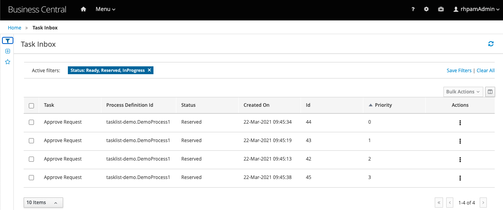

# RHPAM task priority

## How to 
1. Install RHPAM
2. Create Demo process with Human Task and a Variable to prioritize
3. Build rhpam-priority-listener `mvn clean package`
4. Add rhpam-priority-listener to RHPAM `Business-central -> Admin -> Artifacts -> Upload`
5. Add rhpam-priority-listener to you project `Business-central -> Projects -> Project Name -> Settings -> Dependencies -> Add from repository`
6. Register rhpam-priority-listener `Business-central -> Projects -> Project Name -> Settings -> Deployment -> Event listeners -> Add Event Listener`
```java
   new org.exampe.PrioritizerListener("ProcessDefinitionId", "Variable Name", "Task Name")
```
example:
```java
        new org.exampe.PrioritizerListener("tasklist-demo.DemoProcess1", "amount", "Approve Request")
```
7. Start multiple processes with different values of Variable
8. Open Task Inbox `Business-central -> Task Inbox`
9. Add priority column, sort by priority and `Save Filter`

